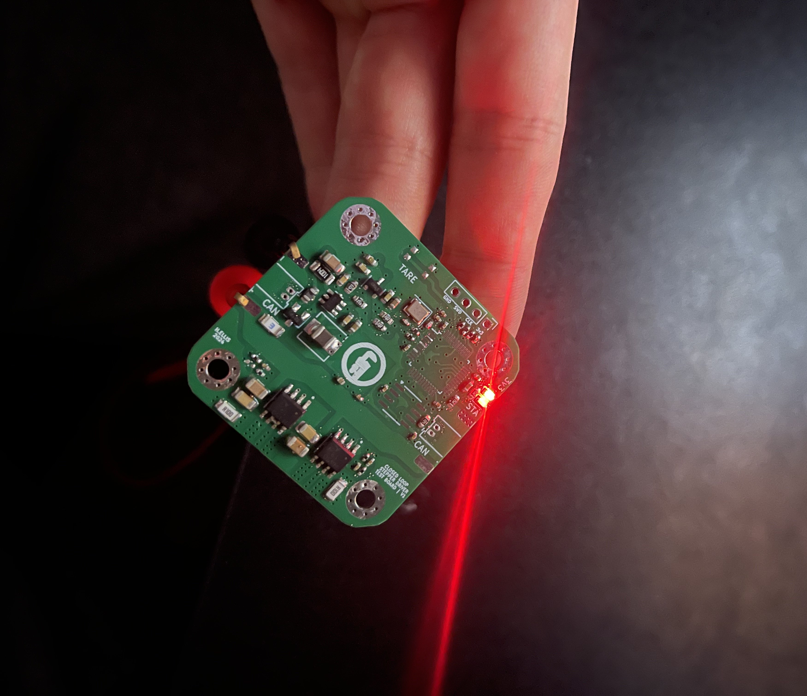

# Closed-Loop-Stepper

A stepper motor using daisey-chained CAN and power connections. Fits on the back of NEMA17 4-wire bipolar stepper motor.

The end goal of this project is to implement a FOC agorithm to control the stepper in closed loop.



*Image of first power test*

## Usage
Install ST and ARM-GNU toolchains.
```
sudo apt install stlink-tools gcc-arm-none-eabi
```
This the firmware for this board is written using libopencm3 (an open-sourced hardware library for ARM Cortex-M3 microcontrollers). Make sure to clone and build libopencm3 in the project repo.
```
git submodule update --init --recursive
```
This design is programmed via SWD (using an ST-Link) -- to build and flash the firmware.
```
cd ./2.Firmware/Base_Driver/src
make
st-flash --reset write base-driver.bin 0x800000
```


*KiCAD render of PCBA*

