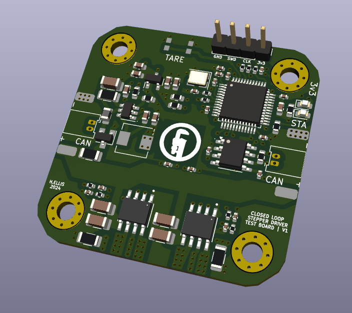

# Closed-Loop-Stepper

A stepper motor using daisey-chained CAN and power connections. Fits on the back of NEMA17 4-wire bipolar stepper motor.

FOC algorithm used for closed loop control.

*KiCAD render of PCBA*

## Bill of Materials
tb67h450 - H Bridge

tja1051r/3 - CAN transceiver

stm32f103c6t6a - microprocessor

as5600 - magnetic encoder

MC34063ABD-TR - buck converter

FDN352AP - p-channel mosfet

MP2456GJ-P - voltage regulator
may need to replace with SCT2401TVB

B5819W-TP - schottky diode

MWLA0503S-6R8MT - inductor

kmr731ng lfs - switch

C3E-12.000-12-1015-R - crystal

PicoBlade 53048-0210 P1.25 horizontal - connector
